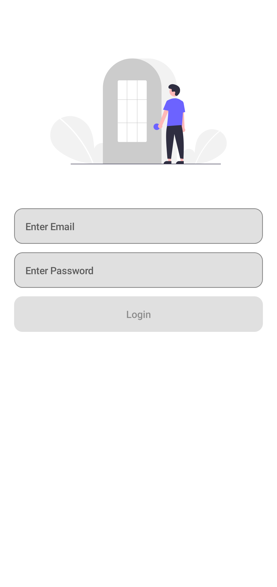
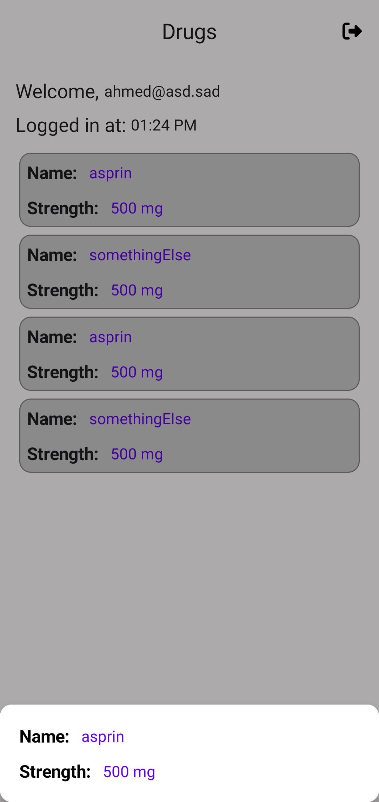
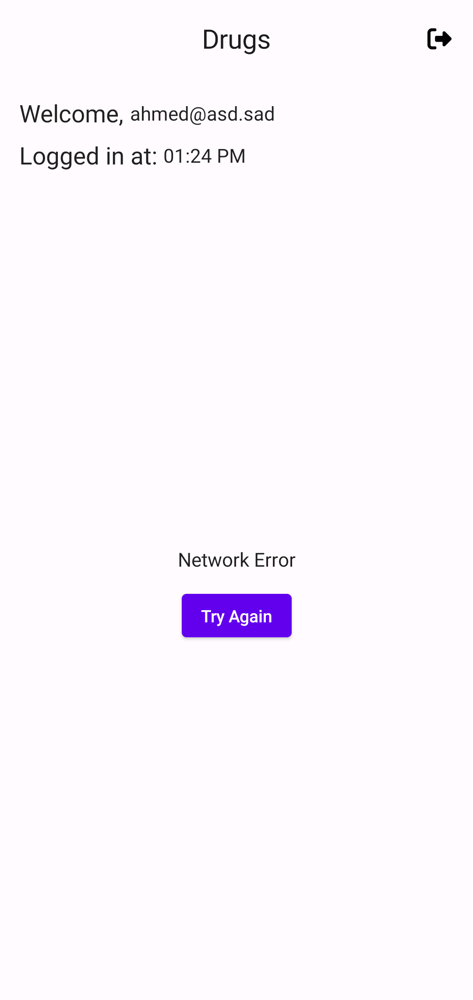
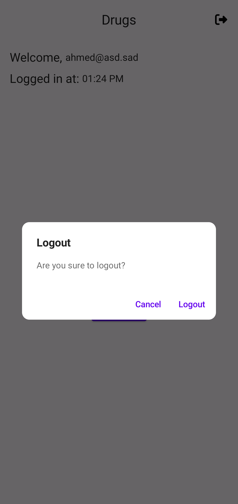

# Diabetes-Task
The Diabetes is to create a simple MVVM project in kotlin and compose

## ScreenShots:

  
  
  
  

## Demo

  

## APK Download
[Click here](https://drive.google.com/file/d/1zz20HCOX_UYV6tDOUNBQer_YyxUQtQ4P/view?usp=sharing)

## In-App architecture

  

## Features
- Obfuscation
- Unit tests
- Simple UI
- Animations
- Config changes handling

## Tools & APIs
- Kotlin
- Clean architecture
- Jetpack Compose
- Compose navigation 
- MVVM + MVI arch pattern
- Coroutines
- Channels & flows
- Retrofit
- Datastore
- Room
- Proguard